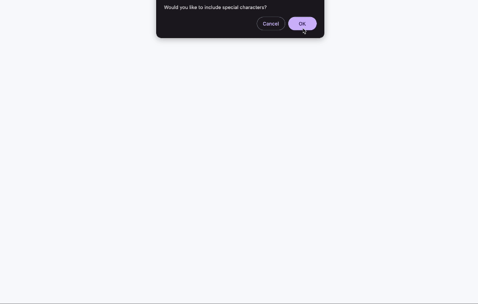

# password-generator

## Description 

A web app that generates a unique password for user depending on their input.

The link to the deployed Github page can be found [here](https://nolythedev.github.io/password-generator/).

## Table of Contents (Optional)

* [Installation](#installation)
* [Usage](#usage)
* [Credits](#credits)
* [License](#license)

## Installation

* Clone the repository: git clone https://github.com/nolythedev/password-generator.git
* Navigate to the project directory: cd password-generator
* Open the codebase in your preferred code editor.

## Usage 

N/A

## Credits

Thank you to the edX, freecodecamp and MDN Web Docs.

## License

MIT License. 

---

© 2024 edX Boot Camps LLC. Confidential and Proprietary. All Rights Reserved.
